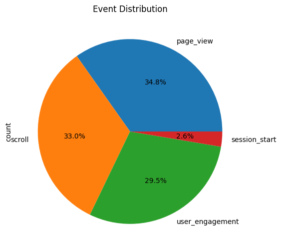
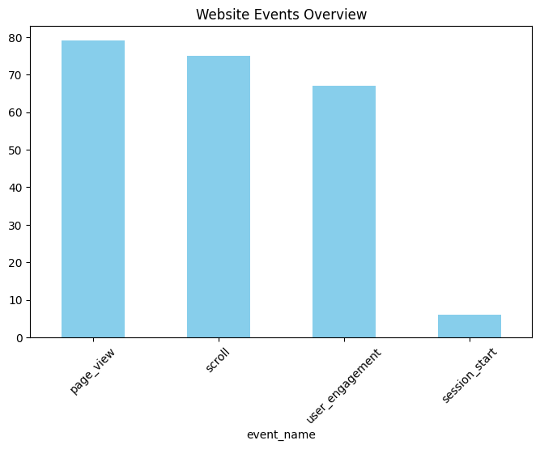

# 📊 Website Traffic Analysis (GA4 + BigQuery)

## 🎯 Objective
Analyze real website user behavior using Google Analytics 4 data stored in BigQuery.

## 🧰 Tools Used
- Google BigQuery
- Python
- Pandas

## 📂 Dataset
`la-vie-est-belle-project.analytics_541902922.events_20260620`

## 📌 What I Did
- Connected Python to BigQuery
- Extracted website event data
- Analyzed user behavior patterns
- Counted events and users

## 📊 Key Insights
- Users interact mostly through page views
- Engagement events show active usage
- Dataset contains real website traffic data
- ## 📊 Visualizations

### Website Events Overview

### Event Distribution

